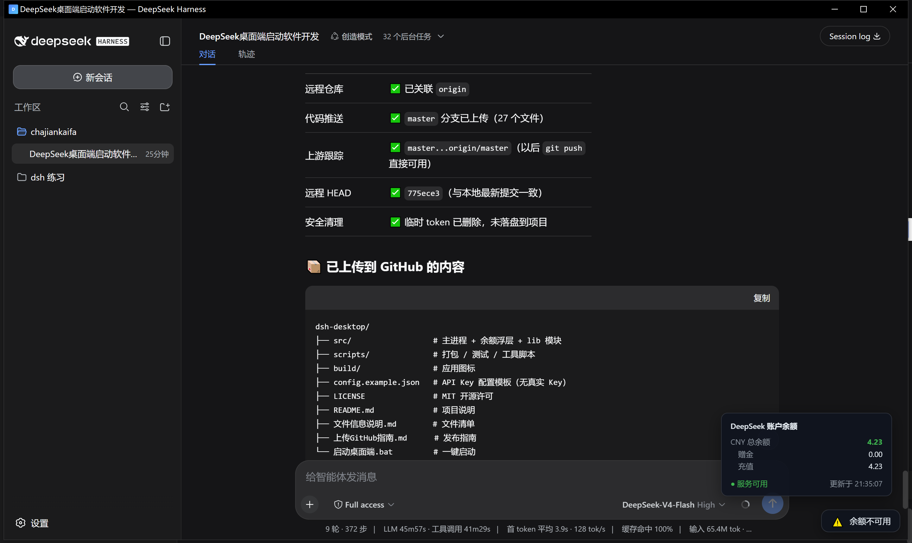

# DeepSeek Harness 桌面版 (DSH Desktop)

一个基于 **Electron** 的 Windows 桌面应用，用于启动并承载 **DeepSeek Harness** 的完整 Web 界面（对话、插件、技能、工作流、子代理、设置等全部功能），并在窗口**右下角实时显示 DeepSeek 账户余额**。

   

> 💡 **通用版**：不含任何个人 API Key，开箱即用，配置你自己的 Key 即可。
> 💡 **无需 Visual Studio / 任何 IDE**：Node.js + Electron，命令行即可运行、测试、打包。
> 🧩 **DeepSeek Harness 社区项目**：本应用是 [DeepSeek Harness](https://github.com/deepseek-ai/deepseek-harness)（DSH）生态的桌面客户端，通过 `dsh-plugin` 主题与官方社区关联。

---

## 📸 运行截图



## ⬇️ 下载安装

前往 [Releases 页面](https://github.com/xuanyuying/dsh-desktop/releases) 下载 **`DSH Desktop Setup 1.0.0.exe`** 安装程序（Windows 10/11，约 95 MB）。

或克隆源码自行构建：

```powershell
git clone https://github.com/xuanyuying/dsh-desktop.git
cd dsh-desktop
npm install
npm start
```

---

## 功能特性

- 🚀 **一键启动**：自动检测 `dsh web` 服务；未运行时自动拉起，已运行时直接复用（端口 `3080`）
- 🖥️ **完整 Harness 内容**：窗口内嵌全部 Web UI，无任何功能裁剪
- 💰 **右下角余额实时显示**：每 30 秒自动刷新 DeepSeek 账户余额；点击手动刷新；悬停查看赠金/充值明细（与左下角"设置"按钮错开，互不遮挡）
- 🪟 **桌面窗口体验**：独立窗口、无地址栏、外链用系统浏览器打开
- 🧹 **干净退出**：由本应用启动的服务在退出时自动关闭，不影响外部已运行的服务

---

## 环境要求

| 依赖 | 版本 | 说明 |
|---|---|---|
| Node.js | ≥ 20 | 必装（含 npm） |
| DeepSeek Harness | ≥ 0.1.0-rc | 通过 `npm install -g @deepseek-ai/dsh` 安装；或由本应用自动发现 npx 缓存 |
| DeepSeek API Key | - | 见下方"API Key 配置" |

---

## API Key 配置（通用版）

按优先级自动读取，**任选其一**：

1. **环境变量**
   ```powershell
   setx DEEPSEEK_API_KEY "sk-你的key"
   ```

2. **应用配置文件（推荐）**
   ```powershell
   # 复制模板到用户目录并填入你的 Key
   copy config.example.json %USERPROFILE%\.dsh-desktop\config.json
   # 编辑 config.json，把 apiKey 改为 sk-你的key
   ```
   配置文件格式：
   ```json
   { "apiKey": "sk-你的DeepSeek-API-Key" }
   ```

3. **兼容读取 Harness 凭据**：若你已用 `dsh` 且 `~/.dsh/.credentials.yaml` 中存在 `DEEPSEEK_API_KEY`，自动复用。

> API Key 获取：https://platform.deepseek.com → API Keys。

---

## 快速开始

### 方式一：直接启动（推荐）

双击项目目录下的 **`启动桌面端.bat`**。

首次运行自动安装 Electron 依赖并下载运行时（需联网，约 2~5 分钟），之后秒开。

### 方式二：命令行启动

```powershell
cd dsh-desktop-desk
npm install          # 首次
npm start
```

---

## 运行测试（无需 IDE）

```powershell
node scripts\smoke-test.js     # 冒烟测试：服务检测 + 余额 API
node scripts\test-lib.js       # lib 模块：12 项断言
node scripts\test-preload.js   # 浮层 UI：11 项断言
```

---

## 打包为安装程序

### 通用方式（默认走 GitHub，需要能访问 GitHub）

```powershell
npm run dist
```

### 国内网络 / 无 GitHub 访问（推荐）

```powershell
node scripts\build-dist.js
```

一键脚本自动完成（全程走 npmmirror 国内镜像、不访问 GitHub）：
1. 从国内镜像下载 NSIS / winCodeSign / nsis-resources 构建工具
2. 解压工具到本地缓存（幂等，二次打包秒过）
3. 自动 patch electron-builder 适配受限环境
4. 使用本地已解压的 Electron（`electronDist`），全程离线
5. 产出 `dist\DSH Desktop Setup 1.0.0.exe`

---

## 项目结构

```
dsh-desktop-desk/
├── src/
│   ├── main.js            # 主进程：Electron 集成（窗口、IPC、生命周期）
│   ├── preload.js         # 预加载：右下角余额浮层 UI + IPC 桥
│   └── lib/
│       ├── harness.js     # Harness 服务检测/启动/停止（纯 Node 模块）
│       └── balance.js     # DeepSeek 余额 API 查询（纯 Node 模块，通用 Key 解析）
├── scripts/
│   ├── build-dist.js          # 一键打包（国内镜像 / 离线）
│   ├── prepare-builder-cache.js  # 构建工具缓存准备
│   ├── download-builder-tools.js # 构建工具下载（npmmirror）
│   ├── smoke-test.js / test-lib.js / test-preload.js  # 测试
│   └── gen-ico.js / download-electron.js / extract-electron.js / patch-builder.js
├── build/                 # 应用图标
├── config.example.json    # API Key 配置模板（通用）
├── package.json
├── 启动桌面端.bat         # 一键启动脚本
└── README.md
```

---

## 常见问题

**Q: 启动时报"未找到 dsh 命令"？**
A: 执行 `npm install -g @deepseek-ai/dsh`，或确认 `dsh` 在 PATH / npx 缓存中。

**Q: 余额显示"不可用"？**
A: 检查 API Key 配置（环境变量或 `~/.dsh-desktop/config.json`），以及网络能否访问 `api.deepseek.com`。

**Q: 关闭窗口后 dsh 服务还在运行？**
A: 若服务由本应用启动，退出时自动关闭；若外部启动（如命令行 `dsh web`），本应用不接管其生命周期。

**Q: 如何修改端口？**
A: 编辑 `src/lib/harness.js` 的 `HARNESS_PORT`（默认 3080），或设置环境变量 `DSH_DESKTOP_PORT`。
