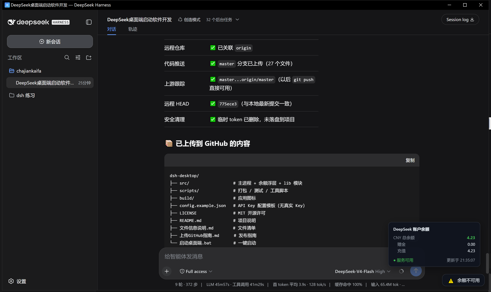

# DeepSeek Harness 桌面版 (DSH Desktop)

一个基于 **Electron** 的 Windows 桌面应用，用于启动并承载 **DeepSeek Harness** 的完整 Web 界面（对话、插件、技能、工作流、子代理、设置等全部功能），并在右上角实时显示**峰谷计价时段**与 **DeepSeek 账户余额**。

    

> 💡 **通用版**：不含任何个人 API Key，开箱即用，配置你自己的 Key 即可。
> 💡 **无需 Visual Studio / 任何 IDE**：Node.js + Electron，命令行即可运行、测试、打包。
> 🧩 **DeepSeek Harness 社区项目**：本应用是 [DeepSeek Harness](https://github.com/deepseek-ai/deepseek-harness)（DSH）生态的桌面客户端，通过 `dsh-plugin` 主题与官方社区关联。

---

## ✨ 功能特性

### 🖥️ 桌面集成
- **标准菜单栏**：文件 / 编辑 / 视图 / 工具 / 帮助，其后是一个**常驻实时状态标签**
  - 文件：新建会话（Ctrl+N）、刷新界面（Ctrl+R）、在浏览器打开、打开配置目录、**设置…（Ctrl+,）**、退出
  - 编辑：撤销 / 重做 / 剪切 / 复制 / 粘贴 / 全选
  - 视图：重新加载（F5）、强制重载、缩放、全屏（F11）、开发者工具（F12）、**关闭时最小化到托盘**、**开机自动启动**
  - 工具：**检查 dsh 更新**、重启 dsh 服务、查看服务状态、打开日志、**内置日志查看器（Ctrl+Shift+L）**、**检查 DSH Desktop 更新**、**结束占用端口的服务**
  - 帮助：官方文档、项目主页、反馈问题、关于
  - **状态标签**：紧跟「帮助」之后，形如 `空闲，2小时30分转高峰，余额：¥7.33`，点击展开时段、倒计时、守卫状态、余额明细、本机高峰窗口、当前价目与相关操作
- **快捷键**：Ctrl+N 新建会话、F5 刷新、F11 全屏、F12 开发者工具、Ctrl+, 设置
- **托盘**：可最小化到系统托盘常驻；托盘菜单可显示/隐藏窗口、查看峰谷状态、打开日志、退出
- **窗口记忆**：位置与大小持久化，且**按当前显示器工作区自动收敛** —— 在 1440×900 或 1366×768 等小屏上不会被任务栏裁掉底部输入区
- **应用内更新**：菜单「工具 → 检查 DSH Desktop 更新」直接查 GitHub Releases、下载安装包并一键安装（退出 → 安装 → 自动重开）

### 🔐 安全与稳定
- **端口冲突不再误杀**：首选端口（默认 3080）被其它服务占用时，应用**自动退让到下一个空闲端口**，绝不会结束别人正在使用的服务（也包括你自己正在跑的 harness）。确需清理时用菜单「工具 → 结束占用端口的服务」，且会二次确认
- **导航白名单**：主框架只允许停留在 harness 自身地址，页面里的外部链接交给系统浏览器打开，不会把外部站点加载进应用窗口
- **渲染进程沙箱**：`sandbox: true` + `contextIsolation: true` + `nodeIntegration: false`
- **零 token 保证可验证**：守卫插件写心跳，界面据此判断保护是否真的生效（见下）
- **安全模式**：设 `DSH_DESKTOP_SAFE=1` 启动可跳过托盘等窗口管理功能，仅保留「起服务 + 载界面」，用于异常时快速恢复

### 🔑 API Key 与设置面板
- 菜单「文件 → 设置…」图形化配置，**优先用系统加密存储**（Windows DPAPI / `safeStorage`），不再只能手工编辑 JSON
- 首次运行自动创建 `~/.dsh-desktop/config.json`（此前只能照报错信息手动创建）
- 已配置的 Key **不会被回读显示**；界面上只显示「是否已配置 + 来源 + 是否加密」
- 解析优先级：环境变量 `DEEPSEEK_API_KEY` → 应用配置（加密或明文）→ Harness 凭据 `~/.dsh/credentials.yaml`

### ⏰ 峰谷时段与「高峰零 token 消耗」

按 DeepSeek 官方[峰谷计价规则](https://api-docs.deepseek.com/quick_start/pricing)在本地判定时段并强制执行：

> **高峰 = 周一至周五 01:00–04:00 与 06:00–10:00（UTC）**，其余时间（含整个周末）为空闲时段；**空闲价 = 高峰价 5 折**。

换算北京时间：高峰为**周一至周五 09:00–12:00 与 14:00–18:00**。应用按你本机时区实时换算，不只显示 UTC。

**显示**：**内嵌在菜单栏**（紧接「帮助」之后）的常驻状态标签：

| 状态 | 菜单栏标签 |
| --- | --- |
| 空闲时段 | `空闲，2小时30分转高峰，余额：¥7.33` |
| 高峰时段 | `高峰，1小时30分转空闲，余额：¥7.33` |

**点击后显示详细信息**：

- 时段与折扣、距离切换的倒计时
- **守卫状态**：`运行中 —— 高峰不消耗任何 token` / `待命` / `已临时放行` / `已关闭` / `⚠ 未生效`
- 账户余额，以及赠金 / 充值明细
- 本机时间下的高峰窗口（自动按你的时区换算）
- 当前各模型价目
- 操作项：零 token 开关、临时放行、重启服务以启用保护、在页面上显示悬浮小卡、查看详情、刷新、官方计价说明

> **为什么也放在菜单栏**：原生菜单**永远不会遮挡 Web 内容，也不会抢走页面里的点击**（包括右侧栏的按钮）。
> 说明：Windows 的应用菜单由系统从左往右排布，Electron 未提供菜单项右对齐的能力，因此它位于「帮助」右侧，而不是贴着窗口最右边缘。

### 页面上的悬浮小卡

除了菜单栏标签，页面里还有一张小卡，**默认开启并吸附在会话标题旁「XX模式」徽标右侧约 2 个字符处**（按徽标字号计算，窗口缩放时自动重算）：

- **拖动** → 解除吸附，移到任意位置并记住
- **双击** → 恢复吸附
- **点 −** → 折叠成一行
- **悬停** → 完全不透明并展开详情；平时半透明，不干扰阅读
- 想彻底关掉：菜单里取消勾选「在页面上显示悬浮小卡」

**限制**：高峰时段**不消耗任何 token**。实现方式不是「发出请求后再取消」，而是在 harness 侧真正短路模型调用：

- 应用启动 `dsh web` 时会用 `--patch` 注入一个随应用分发的 Cordis 插件 `peak-guard.mjs`
- 该插件监听 `llm/stream`（**包裹每一次流式模型调用的 waterfall**），高峰时段**不调用 `next()`** —— 请求根本不会发往 DeepSeek，因此不产生任何 token 消耗，覆盖普通对话、子代理、工作流、Ralph、压缩等全部路径
- 插件会周期性写出心跳，应用据此校验**保护是否真的生效**；若因复用既有服务等原因导致守卫未加载，界面与菜单会**明确告警**，而不是假装受保护
- 需要临时工作时，菜单「时段与余额 → 临时放行至本时段结束」，到点自动恢复拦截

```
npm test             # 可独立运行的全部单测（不需要 dsh / API Key / 网络）
npm run test:harness # 需要本机 dsh 的一组：端口退让、启动认证、token 复用
npm run test:e2e     # 端到端：真实启动 harness 验证守卫被加载并写出心跳
npm run verify       # 上面全部 + 体检
```

> `test:harness` 这一组使用**临时 DSH_HOME 与随机端口**，不会碰开发机上正在运行的会话。

### 🚀 自动启动前提
启动时自动完成，无需手动执行任何命令：
1. 定位 dsh 命令（全局 npm / npx 缓存 / PATH）
2. 未安装时自动 `npm install -g @deepseek-ai/dsh`
3. 自动启动 `dsh web`（带 `--no-open`，界面由窗口承载而非跳浏览器）
4. 服务就绪后自动加载界面（含渲染检查与失败重试）

### 🔄 版本管理
- 菜单「工具 → 检查 dsh 更新」：对比本地与 npm 最新版本，**一键升级** dsh
- 菜单「工具 → 检查 DSH Desktop 更新」：查 GitHub Releases 并一键安装本应用
- 升级后提示重启服务以生效

### 🔌 DeepSeek Harness 0.1.5+ 适配
- **认证机制适配（关键）**：0.1.5 起 `dsh web` 需要认证，裸访问返回 401。本应用会捕获启动输出中的**带 token URL** 并用它加载界面（303 → cookie → 200），彻底解决黑屏
- **端口冲突自动退让**：首选端口被无法认证的遗留服务占用时，自动改用下一个空闲端口启动自己的服务（**不会结束任何进程**）
- **代理支持**：传递 `HTTP_PROXY` / `HTTPS_PROXY` / `ALL_PROXY` / `NO_PROXY` 环境变量（0.1.5 新增）
- 兼容 `--no-open` 官方参数（0.1.5 官方推荐用法）
- 支持 0.1.5 新特性：DeepSeek-V41-Flash 模型、任意文件上传、右侧 Sidebar 预览

### 📖 文档

| 文档 | 内容 |
| --- | --- |
| [使用手册](docs/usage.md) | 安装、菜单栏状态、峰谷与零 token、API Key、托盘与更新 |
| [故障排查](docs/troubleshooting.md) | 启动失败、端口冲突、守卫未生效、余额不可用… |
| [代码签名与校验](docs/signing.md) | SmartScreen 说明、如何核实下载、如何接入签名证书 |

### 🩺 诊断工具

遇到启动问题时运行（输出环境、服务、认证、余额、代理状态）：

```powershell
node scripts\doctor.js
```

---

## 📸 运行截图



## ⬇️ 下载安装

前往 [Releases 页面](https://github.com/xuanyuying/dsh-desktop/releases) 下载 **`DSH Desktop Setup 1.3.2.exe`** 安装程序（Windows 10/11，约 95 MB）。

或克隆源码自行构建：

```powershell
git clone https://github.com/xuanyuying/dsh-desktop.git
cd dsh-desktop
npm install
npm start
```

---

## 功能特性

- 🚀 **一键启动**：自动检测 `dsh web` 服务；未运行时自动拉起，已运行时直接复用（端口 `3080`）
- 🖥️ **完整 Harness 内容**：窗口内嵌全部 Web UI，无任何功能裁剪
- 💰 **右下角余额实时显示**：每 30 秒自动刷新 DeepSeek 账户余额；点击手动刷新；悬停查看赠金/充值明细（与左下角"设置"按钮错开，互不遮挡）
- 🪟 **桌面窗口体验**：独立窗口、无地址栏、外链用系统浏览器打开
- 🧹 **干净退出**：由本应用启动的服务在退出时自动关闭，不影响外部已运行的服务

---

## 环境要求

| 依赖 | 版本 | 说明 |
|---|---|---|
| Node.js | ≥ 20 | 必装（含 npm） |
| DeepSeek Harness | ≥ 0.1.0-rc | 通过 `npm install -g @deepseek-ai/dsh` 安装；或由本应用自动发现 npx 缓存 |
| DeepSeek API Key | - | 见下方"API Key 配置" |

---

## API Key 配置（通用版）

按优先级自动读取，**任选其一**：

1. **环境变量**
   ```powershell
   setx DEEPSEEK_API_KEY "sk-你的key"
   ```

2. **应用配置文件（推荐）**
   ```powershell
   # 复制模板到用户目录并填入你的 Key
   copy config.example.json %USERPROFILE%\.dsh-desktop\config.json
   # 编辑 config.json，把 apiKey 改为 sk-你的key
   ```
   配置文件格式：
   ```json
   { "apiKey": "sk-你的DeepSeek-API-Key" }
   ```

3. **兼容读取 Harness 凭据**：若你已用 `dsh` 且 `~/.dsh/.credentials.yaml` 中存在 `DEEPSEEK_API_KEY`，自动复用。

> API Key 获取：https://platform.deepseek.com → API Keys。

---

## 快速开始

### 方式一：直接启动（推荐）

双击项目目录下的 **`启动桌面端.bat`**。

首次运行自动安装 Electron 依赖并下载运行时（需联网，约 2~5 分钟），之后秒开。

### 方式二：命令行启动

```powershell
cd dsh-desktop-desk
npm install          # 首次
npm start
```

---

## 运行测试（无需 IDE）

```powershell
node scripts\smoke-test.js     # 冒烟测试：服务检测 + 余额 API
node scripts\test-lib.js       # lib 模块：12 项断言
node scripts\test-preload.js   # 浮层 UI：11 项断言
```

---

## 打包为安装程序

### 通用方式（默认走 GitHub，需要能访问 GitHub）

```powershell
npm run dist
```

### 国内网络 / 无 GitHub 访问（推荐）

```powershell
node scripts\build-dist.js
```

一键脚本自动完成（全程走 npmmirror 国内镜像、不访问 GitHub）：
1. 从国内镜像下载 NSIS / winCodeSign / nsis-resources 构建工具
2. 解压工具到本地缓存（幂等，二次打包秒过）
3. 自动 patch electron-builder 适配受限环境
4. 使用本地已解压的 Electron（`electronDist`），全程离线
5. 产出 `dist\DSH Desktop Setup 1.2.1.exe`

---

## 项目结构

```
dsh-desktop-desk/
├── src/
│   ├── main.js            # 主进程：Electron 集成（窗口、IPC、菜单、生命周期）
│   ├── menu.js            # 应用菜单栏（文件/编辑/视图/工具/帮助）
│   ├── preload.js         # 预加载：右下角余额浮层 UI + IPC 桥
│   └── lib/
│       ├── harness.js     # Harness 服务检测/启动/停止 + 版本检测升级（纯 Node）
│       └── balance.js     # DeepSeek 余额 API 查询（纯 Node 模块，通用 Key 解析）
├── scripts/
│   ├── build-dist.js          # 一键打包（国内镜像 / 离线）
│   ├── prepare-builder-cache.js  # 构建工具缓存准备
│   ├── download-builder-tools.js # 构建工具下载（npmmirror）
│   ├── smoke-test.js / test-lib.js / test-preload.js / test-menu.js  # 测试
│   └── gen-ico.js / download-electron.js / extract-electron.js / patch-builder.js
├── build/                 # 应用图标
├── config.example.json    # API Key 配置模板（通用）
├── package.json
├── 启动桌面端.bat         # 一键启动脚本
└── README.md
```

---

## 常见问题

**Q: 启动时报"未找到 dsh 命令"？**
A: 执行 `npm install -g @deepseek-ai/dsh`，或确认 `dsh` 在 PATH / npx 缓存中。

**Q: 余额显示"不可用"？**
A: 检查 API Key 配置（环境变量或 `~/.dsh-desktop/config.json`），以及网络能否访问 `api.deepseek.com`。

**Q: 关闭窗口后 dsh 服务还在运行？**
A: 若服务由本应用启动，退出时自动关闭；若外部启动（如命令行 `dsh web`），本应用不接管其生命周期。

**Q: 如何修改端口？**
A: 设置环境变量 `DSH_DESKTOP_PORT`（默认 3080）。端口被占用时应用会自动退让到下一个空闲端口，不会结束占用进程。

更多问题见 [故障排查](docs/troubleshooting.md)。

---

## 图标与商标

应用图标使用 DeepSeek 官方鲸鱼标识，重绘为「鲜明蓝底 `#2B5CFF` + 白色鲸鱼」的圆角方块：

```powershell
npm run icon   # 从 build/whale-source.png 重绘 build/icon.png 并生成多尺寸 icon.ico
```

- 圆角方块比裸字形在 16px 任务栏下清晰得多，深色/浅色背景都可见
- 换配色：改 `scripts/make-icon.ps1` 顶部的 `$bgR/$bgG/$bgB`（底色）、`$inkR/$inkG/$inkB`（鲸鱼色）、`$fill`（占比）后重跑

`build/whale-source.png` 取自 DeepSeek 官方站点 favicon，仅用于标识本应用是 DeepSeek Harness 的桌面客户端。
**DeepSeek 名称与鲸鱼标识归 DeepSeek 所有**，本项目与 DeepSeek 官方无隶属关系；若官方有异议会立即更换。

## 许可

[MIT](LICENSE)

